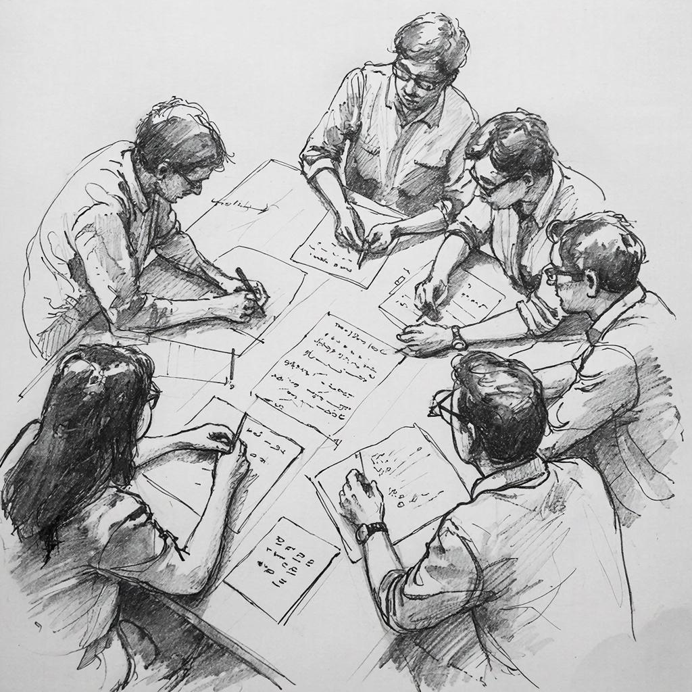

# 🏆 AINL-Eval 2026 Shared Task at AINL 2026

Welcome to the repository for the **AINL-Eval 2026** shared task on prompt compression held as part of the [AINL 2026](https://ainlconf.ru/) conference.

## 💡 Motivation

Recent advancements in large language models (LLMs) have made them increasingly accessible across various domains. 

Despite this progress, generating outputs from these models remains computationally intensive and costly, particularly due to lengthy input prompts. 

Given that certain parts of an input prompt might contribute minimally to the output's relevance, optimizing the prompt structure becomes crucial for efficiency without compromising response quality.

## 📝 Competition description

Participants must devise methods capable of compressing input prompts while preserving or even improving the quality of model-generated outputs. 

Specifically, the challenge involves reducing the size of provided prompts while ensuring accurate generation of high-quality responses.

You can train your solution using any dataset available to you.

**The target metrics**:

- Compression Ratio: length of compressed prompts divided by original prompt length (characters).
- Score: proportion of correct answers produced when running the model with your optimized prompts.
- Overall Score: Compression Ratio x Score.

You should submit the compressed version of the given prompts. The model (which is unknown for the participants during the competition) will be run on the submitted data, and the answers will be evaluated against ground truths.

If the overall length of submission (in chars) is not less than the initial lengths, then the answers evaluation won't be run and the Score will be 0.0 by default.

The team achieving the highest Overall Score wins.

## ✅ How to submit

1. Download [file](/data/val_set_input.csv) with the prompts.
2. Apply your method to compress and improve the prompts.
3. Write the results into the file. Name this file `submit.csv`.
4. Compress this file (only file, not a directory with the file). Ensure that the file has name `submit.csv` and contains fields `id` and `input`.
5. Go to [Codabench Competition](https://www.codabench.org/competitions/14291/).
6. Submit your file.
7. If submission is successful, publish the results to Leaderboard.

After successful submission, you may download the detailed results: Click on your submission -> Downloads -> Output from scoring step .

## ⚖️ Participation rules

See the Competition rules [here](rules.md).

During the Development phase each team has **3 attempts to submit per day**.

Final results will be obtained on the private test set and announced during the AINL 2026 conference. 

Each team will have **3 attempts to submit final results** at all. 

After the competition is over, we will publish the ground truths for the test set, so the participants could perform some ablation studies.

## 📌 Important dates

🟢 *5 March 2026* - Competion starts

🟠 *27 March 2026* - Test phase is open

🟠 *3 April 2026* – The shared task is closed. Submissions to both dev and test phases are no longer accepted.

🟠 *17-18 April 2026* – AINL 2026 conference. The final results are announced.

## 👥 Organizers

Elena Bruches (IIS SB RAS, NSU)

Valentin Malykh (MIPT University, ITMO University)

Tatiana Batura (IIS SB RAS)

## ☎️ Our contacts

If you have any questions, feel free to ask them in any way:

1. Create Issue in this repo
2. Write in TG channel: https://t.me/ainleval2026
3. Write in VK.com: https://vk.com/ainlconf
4. Write to e-mail: bruches@bk.ru

